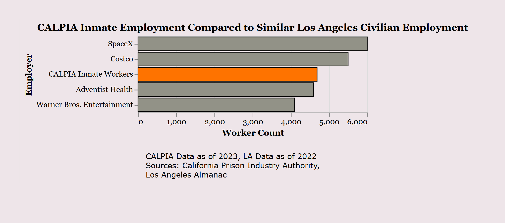

# Strong Bars, Weaky Pay

Ganon Evans

## Description

This project is a "scrollytelling" article on wages for inmates in California's prison industry. I was inspired by finding the original ACLU report to do some comparisons with how much an inmate makes relative to a worker in the same industry. Graphs were generated using Altair then stylized for the project. The article can also be found hosted at this website.

## Data Sources

[ACLU](https://www.aclu.org/wp-content/uploads/publications/2022-06-15-captivelaborresearchreport.pdf)
[California Department of Corrections - Fire News](https://www.cdcr.ca.gov/insidecdcr/2024/09/13/week-in-review-september-13-2024/)
[California Employment Development Department](https://labormarketinfo.edd.ca.gov/data/oes-employment-and-wages.html#OES)
[California Prison Industry Authority](https://www.calpia.ca.gov/wp-content/uploads/calpia/news/Reports_and_Publications/Report%20To%20The%20Legislature%20FY%202022-23%20APPROVED-PIA.pdf)
[Cal Matters](https://calmatters.org/justice/2025/10/prison-firefighter-new-laws/)
[California State Auditor](https://information.auditor.ca.gov/reports/summary/2010-118)
[Investigate Media](https://investigate.afsc.org/prison-labor-california-state-prisons)
[KQED News](https://www.kqed.org/news/12022277/inmate-firefighters-battling-la-fires-have-trouble-getting-firefighting-jobs-after-release)
[Los Angeles Almanac](https://www.laalmanac.com/employment/em21e.php)
[Payscale](https://www.payscale.com/cost-of-living-calculator/California-Bakersfield)
[Soly Moses Photography](https://www.pexels.com/photo/dramatic-nighttime-forest-fire-in-california-28317514/)
[VC Star](https://www.vcstar.com/story/news/local/california/2024/09/10/more-than-906000-acres-burned-during-californias-wildfires/75158688007/)
[University of Chicago News](https://news.uchicago.edu/story/us-prison-labor-programs-violate-fundamental-human-rights-new-report-finds)

